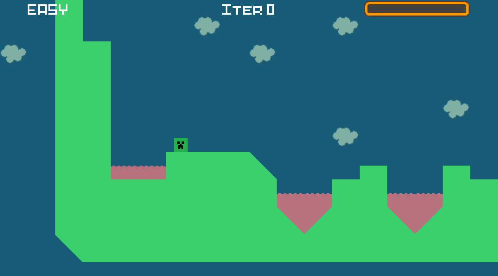
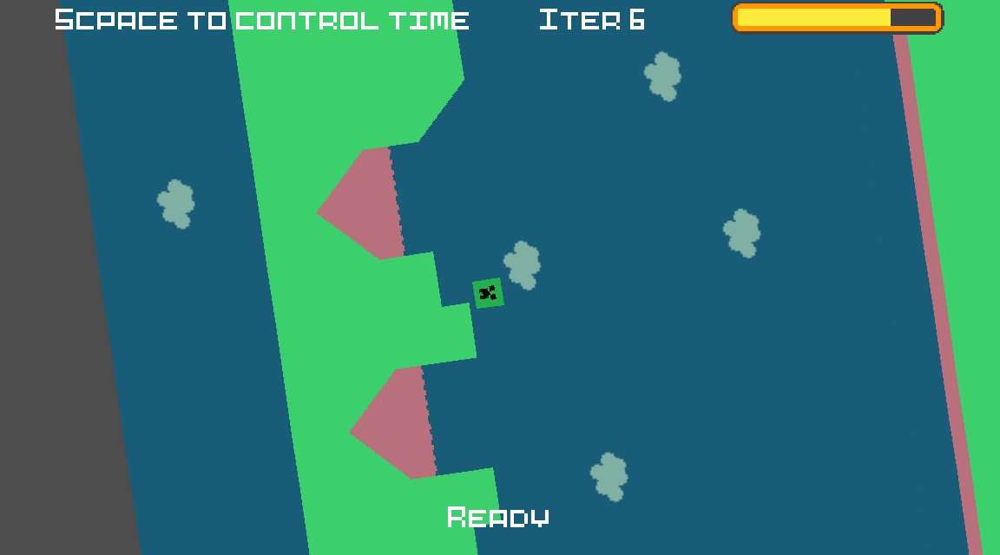
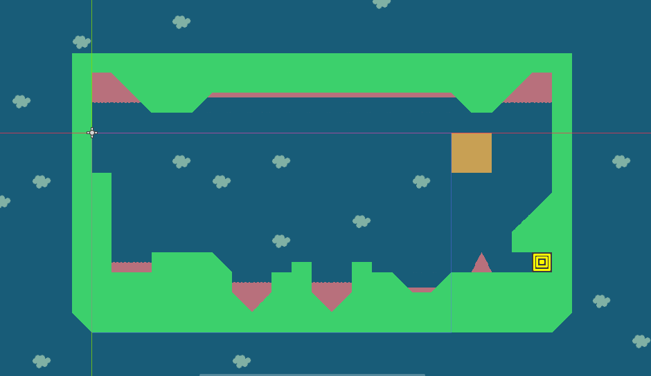

# A one LVL game

Un juego donde los niveles siempre presentan el mismo aspecto, pero los controles cambian de nivel a nivel, haciendo que los jugadores desarrollen diferentes estrategias para el mismo recorrido en función de lo que se les es permitido hacer.



Para el desarrollo he utilizado el *game engine* Godot ya que es gratuito y el *godotscript* no parece complicado de utilizar.

El resultado final se puede encontrar en https://failingcollege.itch.io/1lvl .

# Diseño

Algo sencillo ya que es un juego muy pequeño. La idea es tener un *singleton* que se encargue de gestionar una clase *Player*, en concreto el objeto de esta que se encarga de procesar el *input* del jugador, y la escena que le toca jugar junto con la gestión de los otros elementos de la pantalla.

Dentro de la función de carga de la nueva escena, en el *singleton* podemos ver como, si la escena es de un nivel, creamos los nuevos controles de la escena así como los asignamos y guardamos:

```python
elif scene == "level": # Level Scene
    # Update level
    self.current_level += 1

    # Update controls
    if not self.override_controls:
        self.current_input_file = self.inputs[self.current_level]
        self.current_input_script = load(INPUTS_BASE_PATH + self.current_input_file)
        self.input_control = self.current_input_script.new()
        else:
            self.input_control = self.override_script.new()
```

Entonces en la clase *Player* pedimos al *singleton* que procese el input por nosotros:

```python
func _physics_process(delta):
    if self._state == DEAD:
        self.vel = move_and_slide(self.vel, Vector2.UP)
        return

    self.delta = delta
    # Delegate input
    GLOBAL.process_input(self)

    # Move
    # Apply gravity
    self.gravity_vector = $Pivot/GravityVector.global_transform.y.normalized()
    self.vel += self.gravity * self.delta * self.gravity_vector
    if self._state == JUMPING:
        self.vel = self.move_and_slide(self.vel, self.scene_floor)
        self.update_state(FALLING)
        else:
            self.vel = self.move_and_slide_with_snap(self.vel, Vector2(0, 32) ,self.scene_floor,true,4,0.8)
```

Cada uno de los distintos objetos encargados de coger *inputs* tendrán que implementar las funciones:

- `get_player_input(var player : KinematicBody2D) -> void`
- `get_scene_input(var scene : Node2D) -> void`

Así como llenar la variable `var hint:String` con la pista del *input* que desean dar al jugador.

## Tipos de *inputs*

- **Easy**: se mueve con las flechas del teclado. Cada flecha representa la dirección correcta y se permite el cambio de dirección en mitad de un salto.

- **Reverse easy**: las flechas representan la dirección opuesta hacia donde se mueve el jugador al pulsarlas.

- **Slide**: las flechas marcan la dirección real de movimiento solo que ahora el jugador resbala sobre las superficies. Le es imposible para quieto a no ser que lo pare un obstáculo.

- **Swap easy & reverse**: los controles cambian entre los dos primeros mencionados cada tres segundos, haciendo que el jugador tenga que llevar el control mental del tiempo.

- **Reverse normal**: igual que el segundo de la lista con la restricción de no poder cambiar de dirección sin estar en contacto con el suelo.

- **Normal**: igual que el primero de la lista con la restricción de no poder cambiar de dirección sin estar en contacto con el suelo.

- **Rotate**: mi preferido, en este con las flechas controlas el nivel más que el jugador. Cambias hacia donde influye la gravedad rotando el nivel y con el espacio puedes dilatar el tiempo, para tener un mejor control, durante unos segundos.

  

- **Reverse slide**: igual que el **slide** solo que invirtiendo las direcciones de las flechas del teclado.

## El nivel



Es un mapa sencillo, pero tiene diversos elementos que impiden la misma estrategia con los distintos controles. Por ejemplo la pequeña isla del medio impide que el jugador con los controles de *Slide* pueda saltar directamente haciendo un rebote ya que caerá en el pequeño lago de lava de más adelante. También el caso de los controles *Normal* la pirámide de lava del final representa un difícil obstáculo a esquivar ya que se tiene que coordinar el salto anterior con sumo cuidado para caer en justo antes.
